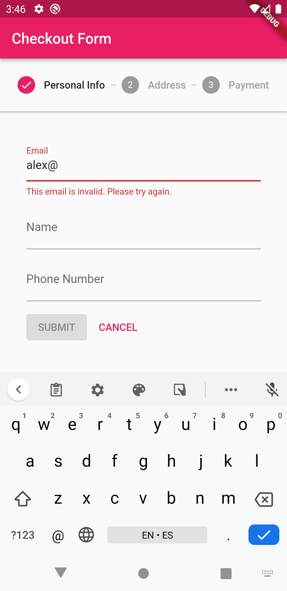
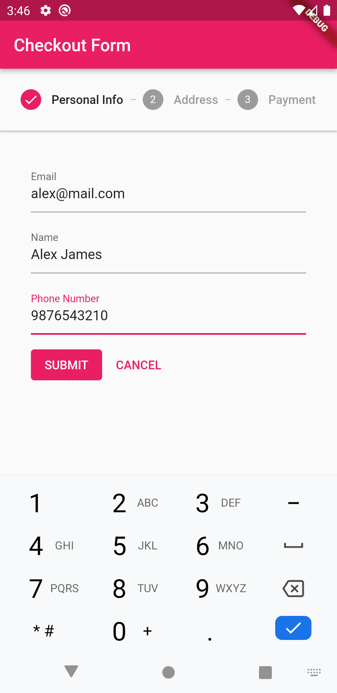
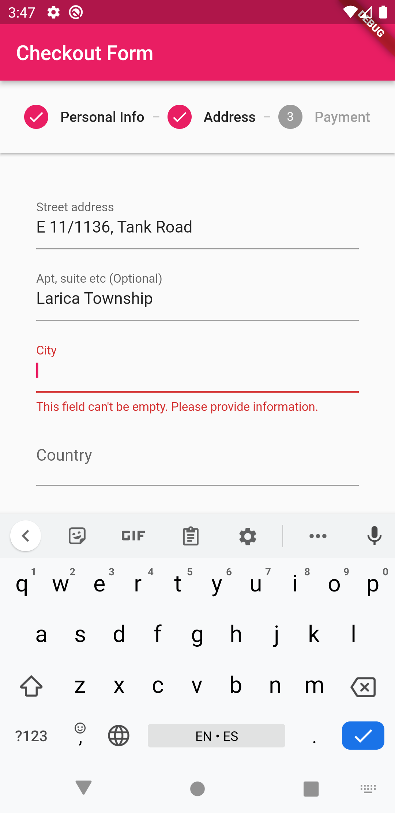
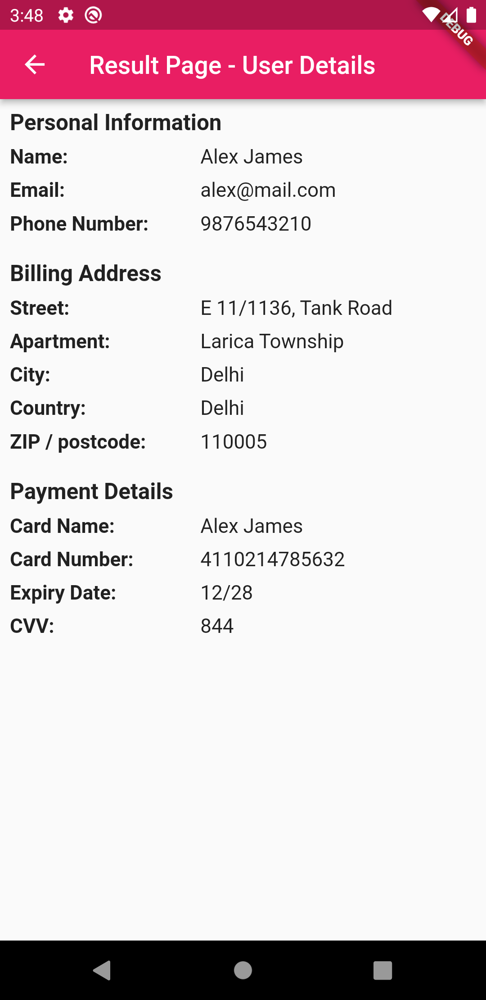

# Multi-page Form Flow

Learn how to build a multi-step form flow and how to use bloc to effectively isolate the presentation layer from the business logic layer.

This project shows - 
- how to create internal packages to effectively structure application.
- how to use RepositoryProvider from [flutter_bloc](https://pub.dev/packages/flutter_bloc) package.
- how to use [formz](https://pub.dev/packages/formz) and work with validated object instead of primitive types.
- how to use Bloc to work with Forms and Validations.
- how to work with BlocBuilder, BlocListener and BlocListener to create the view.
- how to and when to use Cubits to design Business Logic of the Stepper. 
- how to use the Stepper widget to create a multi-step form.

> **Note** 
> Read the article [here on Medium](https://medium.com/@thecodexhubofficial/multi-step-form-with-flutter-bloc-and-stepper-widget-8d65b611cce1). 👈

## Preview

<table><tr>
<td style="text-align: center">

</td>
<td style="text-align: center">

</td>
<td style="text-align: center">

</td>
<td style="text-align: center">

</td>
<td style="text-align: center">

</td>
</tr></table>

## Getting Started

For help getting started with Flutter development, view the
[online documentation](https://docs.flutter.dev/), which offers tutorials,
samples, guidance on mobile development, and a full API reference.

### If you like this repository, kindly give it a star ⭐
